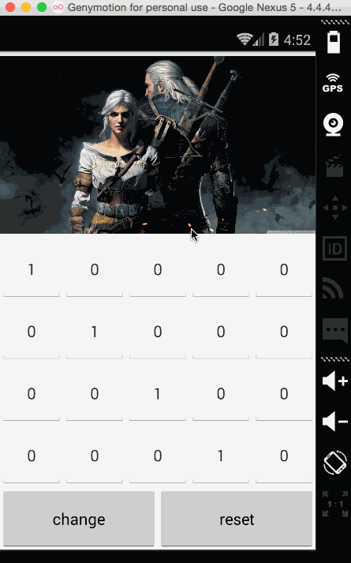

# imooc-practice-android
慕课上的Android合集

### 图片处理初识别效果图



#### 色彩特效处理笔记

> 图片都是由点阵和颜色值组成的.
> - 所谓点阵就是一个包含像素的矩阵,每一个元素对应着图片上的一个像素.
> - 颜色值即ARGB. 分别对应着alpha,red,green,blue.

色彩处理中通常使用一下三个角度来描述一个图像.

- 色调(tone)
- 饱和度(saturation)
- 亮度(sluminance)

Android本身封装了一些API用于快速调整矩阵来实现改变色光属性.

```
// 改变色调
// 0,1,2分别代表Red,Green,Blue
// tone 代表角度 通常范围[-180,180]
ColorMatrix toneMatrix = new ColorMatrix();
toneMatrix.setRotate(0,tone);
toneMatrix.setRotate(1,tone);
toneMatrix.setRotate(2,tone);
```

```
// 改变饱和度
// saturation[0,2] 当饱和度为0时,图像就变为灰色图像了
ColorMatrix saturationMatrix = new ColorMatrix();
saturationMatrix.setSaturation(saturation);
```

```
// 改变亮度
// lum[0,2] 当亮度为0时,图像就变为全黑了.
ColorMatrix lumMatrix = new ColorMatrix();
lumMatrix.setScale(lum,lum,lum,1);
```

**postConcat()**方法来讲矩阵的作用效果混合,从而叠加处理效果.

```
ColorMatrix imageMatrix = new ColorMatrix();
imageMatrix.postConcat(toneMatrix);
imageMatrix.postConcat(saturationMatrix);
imageMatrix.postConcat(lumMatrix);
```


### Tab效果图


#### 用ViewPager实现tab笔记

- ImageButton 设置src,background.当点击改变背景时用imageButton.setImageResoure(R.drawable.xxx=);才会生效.

 > setBackgroundResource is for setting the background of an ImageView;
 
 > setImageResource is for setting the src image of the ImageView.
 
- 父布局会将点击事件传给ImageButton,而ImageButton并没有处理点击事件.

  解决方案1 为ImageButton添加监听器处理点击事件(笨)

  解决方案2 将ImageButton设置为不可点击 clickable="false";

- 大致流程

 绘制布局,top,viewpager,bottom.
 
 initViews();
 
 initDatas(); // setPagerAdapter(); 重写4个方法
 
 initListeners(); // 为底部每个tab添加监听器,为viewpager添加监听器.(点击tab,viewPager动,点viewpager,tab跟着动)


#### 用Fragment实现tab笔记 

- Button上写入英文字母会显示大写 在xml中添加android:textAllCaps="false"
- tab之间的fragment会存在点击穿透问题.让每个fragment都继承onTouchListener,重写onTouch();return true即可.
- 大致流程
  
  绘制布局,top,FrameLayout,bottom;

  initView();
  
  initListeners(); //这里只存在点击底部四个tab区域,然后让fragment跟着动就行.FragmentTransaction.hide();FragmentTransaction.sh   ow();FragmentTransaction.commit();
  
  
#### 用FragmentPagerAdapter+ViewPager实现tab笔记
  
 - 和使用ViewPager实现Tab页面类似,不同的是数据源不一样.一个是List\<View\>,一个是List\<FragmentPagerAdapter\>.
 
#### 用TabLayout实现tab笔记
  
 
   ```java
   <android.support.design.widget.TabLayout
        app:tabGravity="fill"                   // fill or center
        app:tabIndicatorColor="#18a342"         // 指示器颜色
        app:tabIndicatorHeight="3dp"            // 指示器的高度
        app:tabMode="fixed"                     // fixed or scrollable 
        app:tabSelectedTextColor="#18a342"      // 选中文本颜色
        app:tabTextColor="#ffffffff"            // 默认文本颜色
        app:tabBackground="@drawable/bottom_bar" // background
        />
   ```
   
 大致流程
   
  - initViews();
  - initDatas(); // 先初始化ViewPager里面的数据(List\<FragmentPagerAdapter\>),然后tabLayout.setupWithViewPager(mViewPager);
   
> tabLayout.getTabAt(position).select(); //指定position位置为点击状态
 

